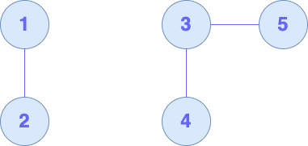

# UnionFind
UnionFindを行う構造体
### Discussion
`UnionFind`は、異なる2つのノードが、同じ連結成分内に存在するか否かを高速に判定します。以下のメソッドを提供しています。
- `union(_ x: Int, _ y: Int)` : 
- `same(_ x: Int, _ y: Int)` : ノード`x`と、ノード`y`が同じ連結成分内に存在するか否かを判定します。存在する場合は、`true`を返します。そうでない場合は、`false`を返します。
- `root(_ num: Int)` : ノード`num`のrootとなるノードの番号を返します。rootは、この構造体については、連結成分を代表するノードを返します。
- `count(_ num: Int)` : ノード`num`が存在する連結成分について、存在するノードの数を返します。
グラフは、0-indexed, 1-indexの両方に対応していますが、一つのインスタンスに対しては、いずれかに統一する必要があります。

### Usage
以下のグラフを考えます。



```Swift
var uf = UnionFind(5) // ノードの数を渡します。
uf.union(1, 2)
uf.union(3, 4)
uf.union(3, 5)

// ノードが同じ連結成分に存在するか。
if uf.same(1, 3) {
	print("Yes")
} else {
	print("No")
} // この場合は、Noを出力する。

uf.count(3) // 3
uf.count(1) // 2
```
### Examples
- [ABC177 D - Friends](https://atcoder.jp/contests/abc177/submissions/79304884)